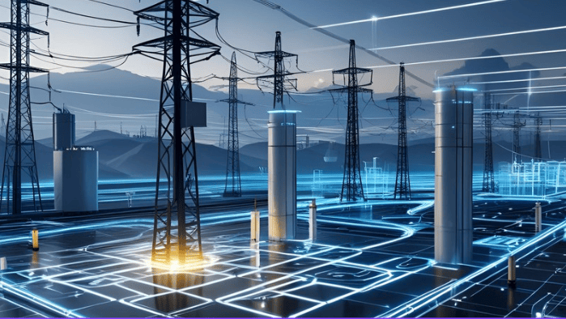

# Project Overview
---

The **Smart Grid Project** aims to create an intelligent energy management system that integrates multiple power stations, consumption areas, and grid management logic. The project will provide a comprehensive platform to monitor, optimize, and control energy flow, ensuring stability, efficiency, and adaptability in response to changing demand or generation conditions.

A key component of this project is the **Power Station Simulator**, which models the behavior of individual power stations, including generation capacity, operational status, and real-time output. While the simulator provides realistic insights into energy production, it represents only a portion of the overall system, which will eventually include real-time sensors, IoT devices, and advanced grid management algorithms.

The broader system will incorporate **consumption zones**, representing residential, commercial, and industrial energy usage. The grid management module will dynamically balance supply and demand, perform intelligent load shedding, and prioritize critical areas when necessary. Real-time monitoring, analytics, and historical trend tracking will help anticipate usage patterns, optimize distribution, and improve decision-making.

**Key points:**

- Power Station Simulator for modeling generation behavior (part of the full project)
- Consumption zones simulating real-world energy usage
- Smart grid management for automated load balancing and prioritization
- Real-time monitoring, analytics, and historical trend tracking
- Scalable architecture for future integration with actual energy infrastructure

The project’s ultimate goal is to provide a flexible platform for managing and optimizing smart grids, bridging simulation with real-world deployment, and allowing incremental expansion from simulation to full system implementation.
